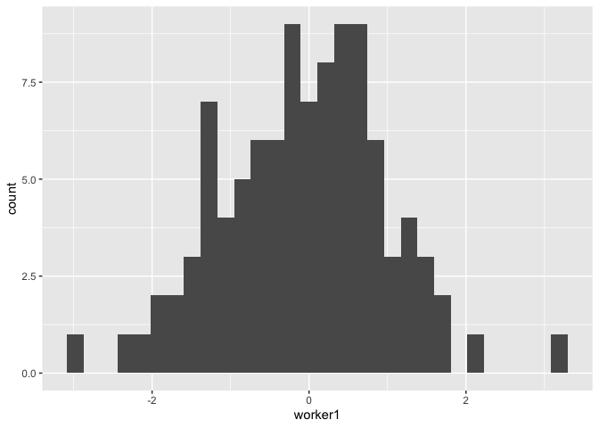
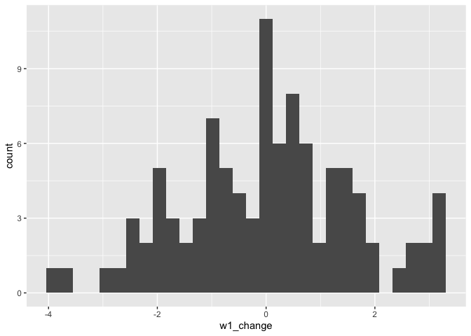

Exercise 1 starter
================

## Introduction

In this starter file, I will show some of the basics of handling raw
data in R. There are several different approaches to loading, querying
and transforming data in R. We’ll be relying on what is sometimes called
a “tidyverse” approach, because it is the easiest to grasp, in terms of
what is happening with data and results at each step of the script. You
can read about this approach (and see very intuitive illustrative
examples) in the free textbook that was written by the authors of the
`tidyverse` package: [R for Data
Science](https://r4ds.hadley.nz/intro "textbook").

## Loading data

We’ll use performance data for three workers that we have discussed in
session 2 (week 1) to illustrate this most intuitive approach. The data
are in a [comma-separated-values
(CSV)](https://en.wikipedia.org/wiki/Comma-separated_values) file, which
we will read using `read_csv()` function. To remind, we need to know a
path to the file on our local drive to be able to load it. Here is how I
do it on my laptop (make sure to update the value of `data_path` below
to point to the folder where you have saved the file on your machine).

``` r
# load tidyverse packages
library(tidyverse, quietly = TRUE, warn.conflicts = FALSE)
```

    ## ── Attaching core tidyverse packages ──────────────────────── tidyverse 2.0.0 ──
    ## ✔ dplyr     1.1.4     ✔ readr     2.1.5
    ## ✔ forcats   1.0.0     ✔ stringr   1.5.1
    ## ✔ ggplot2   3.5.1     ✔ tibble    3.2.1
    ## ✔ lubridate 1.9.3     ✔ tidyr     1.3.1
    ## ✔ purrr     1.0.2     
    ## ── Conflicts ────────────────────────────────────────── tidyverse_conflicts() ──
    ## ✖ dplyr::filter() masks stats::filter()
    ## ✖ dplyr::lag()    masks stats::lag()
    ## ℹ Use the conflicted package (<http://conflicted.r-lib.org/>) to force all conflicts to become errors

``` r
# define path to the file that we are loading - UPDATE this to use on your laptop
data_path = "~/Dropbox/McGill/teaching/2023-2024/summer/ORGB690/data/"

# load the file into a performance_data dataframe
# NOTE: paste0() combines the path to file with the name of the file
performance_data <- read_csv(paste0(data_path, "performance_data.csv"))
```

    ## Rows: 100 Columns: 7
    ## ── Column specification ────────────────────────────────────────────────────────
    ## Delimiter: ","
    ## chr (3): w1_intervention, w2_intervention, w3_intervention
    ## dbl (4): day, worker1, worker2, worker3
    ## 
    ## ℹ Use `spec()` to retrieve the full column specification for this data.
    ## ℹ Specify the column types or set `show_col_types = FALSE` to quiet this message.

## Analyze the data

The data for three workers is now loaded into the `performance_data`
dataframe. You can click on it in the “Environment” tab in RStudio (top
right) to see what the data looks like. Let’s look at some basic
statistics in these data. We’ll do two things:

1.  Get average performance value for each worker

2.  Plot a distribution of day-to-day changes in performance for one of
    the workers.

### Average performance for each worker

First, let’s get the averages.

``` r
# calculate averages with a summarize() function
averages <- performance_data |> 
  # summarize the values of workerX columns into one average per column
  summarise(
    w1_average = mean(worker1),
    w2_average = mean(worker2),
    w3_average = mean(worker3)
  )

# to see what's inside the `averages` dataframe, we simply call it
averages
```

    ## # A tibble: 1 × 3
    ##   w1_average w2_average w3_average
    ##        <dbl>      <dbl>      <dbl>
    ## 1    -0.0621     0.0326     -0.120

Note that we now have two data objects: `performance_data` contains our
original data and `averages` contains just the three averages we’ve
calculated.

### Day-to-day differences

The second step is to visualize the changes from day to day for each
worker in their performance. To do that, we’ll create new variables
(columns) that will track the performance *change* from previous day for
each worker. We’ll use the function lag() to refer to the previous day’s
performance.

``` r
# update the dataframe by adding a new variable for each worker
performance_data <- performance_data |>
  # make sure that the data are arranged by `day` to avoid accidental miscalculations
  arrange(day) |> 
  # add new variables
  mutate(
    w1_change = worker1 - lag(worker1),
    w2_change = worker2 - lag(worker2),
    w3_change = worker3 - lag(worker3),
  )

# let's see what we have now; we'll include only the relevant columns here
performance_data |> 
  select(worker1, w1_change, worker2, w2_change, worker3, w3_change)
```

    ## # A tibble: 100 × 6
    ##    worker1 w1_change  worker2 w2_change  worker3 w3_change
    ##      <dbl>     <dbl>    <dbl>     <dbl>    <dbl>     <dbl>
    ##  1 -1.28    NA        0.639     NA       0.643      NA    
    ##  2  1.41     2.70    -0.0664    -0.705   0.366      -0.277
    ##  3  0.353   -1.06     0.0245     0.0909  0.553       0.187
    ##  4  0.360    0.00737 -0.836     -0.860   1.31        0.753
    ##  5 -0.650   -1.01    -0.00423    0.832  -0.00580    -1.31 
    ##  6  1.71     2.36    -1.16      -1.15   -0.442      -0.436
    ##  7 -0.326   -2.04    -0.297      0.861   0.468       0.910
    ##  8  0.0118   0.338   -1.08      -0.780   0.0172     -0.451
    ##  9  0.248    0.236   -0.396      0.681   1.31        1.29 
    ## 10  0.224   -0.0238   3.43       3.82    0.382      -0.929
    ## # ℹ 90 more rows

### Visualize the data

This looks right. Now let’s visualize the performance and the
differences for worker 1. We’ll use the set of plotting functions
available in `ggplot2` package (which is part of the tidyverse).

``` r
# plot a histogram of worker 1 performance
ggplot(data = performance_data) + geom_histogram(aes(x = worker1))
```

    ## `stat_bin()` using `bins = 30`. Pick better value with `binwidth`.

<!-- -->

Let’s do the same for worker1’s performance changes from day to day.

``` r
# plot a histogram of w1_change
ggplot(data = performance_data) + geom_histogram(aes(x = w1_change))
```

    ## `stat_bin()` using `bins = 30`. Pick better value with `binwidth`.

    ## Warning: Removed 1 row containing non-finite outside the scale range
    ## (`stat_bin()`).

<!-- -->

## Conclusion

This starter code aimed to show some basic steps in data analysis. It’s
intended to help save the time in preparing the exercise.
